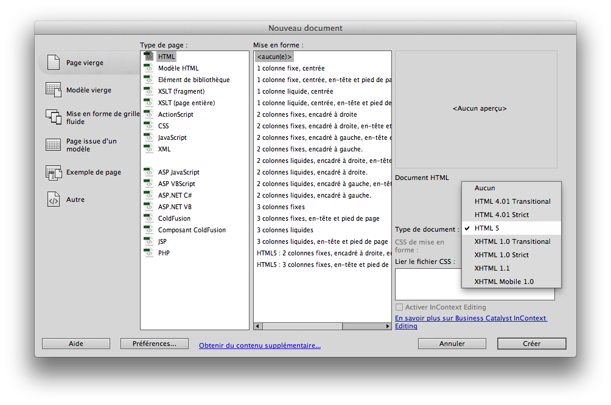
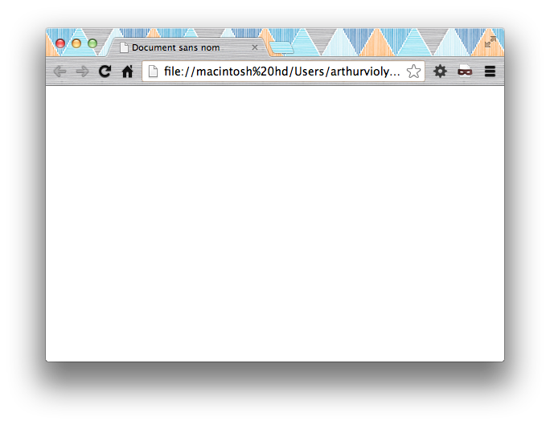
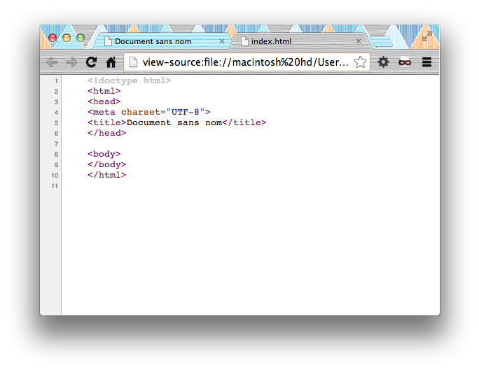
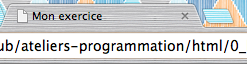
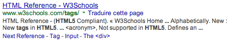
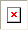

HTML5 Basics
=============

## Site web et page web
un site web est constitué d’un ensemble de fichiers, 
déposés sur un serveur web qui héberge ce site. 
tous les sites web utilisent le langage *HTML*. 
le moyen le plus simple pour créer des sites web est donc de créer directement des fichiers HTML
et de les déposer sur le serveur web. Ces sites sont *statiques* (car le seul moyen de les éditer et de le faire à la main).
il existe d’autre type de sites web — *dynamiques* — qui utilisent des modèles de page (template) 
généralement avec des technologies PHP et des bases de données Mysql.
Ces langages serveurs (PHP, Mysql) ne seront pas abordé dans ce cours.

#### Fonctionnement du HTML
###### HTML
HTML est l’acronyme de **HyperText Markup Language** (language hypertexte en balises). 
un fichier HTML est un fichier texte, constitué en **balises** (tags).


	<div>un exemple de balise html</div>
ce fichier, est interprété par un **navigateur (browser)** 
tel que Mozilla Firefox, Goolge Chrome, Apple Safari ou Microsoft Internet Explorer. 
cette interprétation fait disparaitre les balises HTML, elle les traduit visuellement. 
le HTML est un langage **sémantique**, et sert donc à décrire des documents qui ont du *sens*
Par *sens*, on peut entendre *contenu* de la page. On le distingue de la *forme*. 
Sur le web, cette distinction contenu/forme passe par le couple de langage HTML/CSS. 
les CSS permette de gérer la forme, la mise en page. 
###### CSS
CSS est l’acronyme de **Cascading Styles Sheet** (feuille de Style en cascade)
comme le HTML, le CSS est un fichier texte. 

	.titre{
		color:white;
		font-size:10px;
	}
ce langage permet de gérer le positionnement, les couleurs, les typographies, les décorations et tout ce qui concerne la mise en page. 
les feuilles de style sont généralement placés dans des fichiers .css à côté de la page .html
même si on peut intégrer des styles CSS directement dans le code HTML. 
Cette séparation permet de facilement changer les contenus ou la mise en page de manière autonome, 
car le contenu et le contenant sont séparés. 

#### Éditeurs
pour éditer du code HTML et CSS, un éditeur de *texte simple* (à ne pas confondre avec traitement de texte) peut suffire. 
par *Texte simple* (ou brut) signifie que le fichier contient uniquement des caractères.
les éditeurs de texte simple sont TextEdit ou Smultron (sous Mac) Notepad ou Notepad++ (sous PC) mais il en existe d’autres. 
il existe également des éditeurs web spécialisés — comme Dreamweaver — qui simplifient de nombreuses opérations ainsi que la lisibilité du code.

#### Un nouveau fichier HTML
nous allons créer un nouveau fichier HTML dans Dreamweaver. 

```ATTENTION : on choisit bien HTML5.```
HTML5 C’est la nouvelle norme de document. les anciennes normes étaient *XHTML* et *HTML4*. HTML5 est encore un *Editor's Draft* selon les spécifications de la [W3C](http://www.w3.org/html/wg/drafts/html/master/).


le code généré automatiquement par Dreamweaver est le code minimum valide pour un document HTML5. on commence par sauvegarder le fichier, en le nommant **index.html** — on utilise ce nom de fichier pour la racine (root) du site, c’est la convention. 

    <!doctype html>
    <html>
    <head>
    <meta charset="UTF-8">
    <title>Document sans nom</title>
    </head>
    
    <body>
    </body>
    </html>

quand on ouvre le fichier dans un navigateur, on voit un fichier vide — blanc. Depuis le navigateur on peut aussi afficher le code source HTML depuis le menu, et voir le code original.

on peut voir la source HTML de toutes les pages web


#### Les espaces, tabulation et retours à la ligne
le HTML est insensible au espaces multiples, tabulations et retours à la ligne. 
ainsi, le texte HTML suivant

		Longtemps, 
	je  me        suis 
	
		couché 
	de        bonne         heure.
s’affichera de cette manière dans le navigateur

	Longtemps, je me suis couché de bonne heure.
	
profitant de cela, on se servira des espaces, tabulations et des retours à la ligne, pour conserver la lisibilité du code. 
Aussi, pour assurer des retours à la ligne, on utilisera la balise orpheline `<br/>`. Pour forcer une espace, on utilisera le **code html** `&nbsp;` (**n**o **b**reak **sp**ace)

#### Les balises (tags)
En HTML, pour décrire le contenu, on utilise des balises (tags). chacune de ces balises ont un rôle particulier, qu’il faudra respecter. 
###### les deux formes de balises
il existe deux type de balise, les balises **en paires** et les balises **orphelines**. 

les **balises paires** englobe du texte et peuvent contenir d’autres balises.   
On écrit une balise ouvrante `<balise>` et une balise fermante `</balise>`
	
	<p> 
		un exemple de paragraphe de texte 
	</p>
les **balises orphelines** servent à insérer un élément à un endroit précis,  
comme une image ou un retour à la ligne `<balise />`. 
	
	<br /> ceci est un retour à la ligne
###### les attributs (attributes)
la plupart des balises possède des options, que l’on nomme **attribut**. 
on note les attributs d'une balise de cette manière `<balise attribut=""></balise>`. pour les balises orpheline, la syntaxe est la même `<balise attribut="" />`. Les balises peuvent avoir plusieurs attributs, certains sont obligatoires, d’autres sont facultatifs, on les notera de cette manière `<div id="exemple" class="classe"></div>`

###### le commentaire
comme dans beaucoup de langage informatique, le HTML permet d'inclure des commentaires dans le code, qui seront invisible à l'interprétation. Ces commentaires permettent d'insérer de remarques cachées, ou d’isoler du code HTML temporairement sans le supprimer. la notation du commentaire est aussi une paire ovrante `<!--` et fermante `-->`. Tous le texte situé entre ces deux balise sera ignorée.
	
	du texte visible
	<!-- un commentaire invisible -->
	un autre texte visible <!-- et un autre commentaire
	avec <span>du code ignoré</span>
	-->

###### des balises imbriquées
le langage HTML repose sur une imbrication de balise (hérité du XML). On l’a vu la vu précédement, les balise paires permettent d’inclure du texte. Elle permettent en outre d'inclure des balises. on parlera de balise **enfant/parent** et d’**arborescence** pour décrire cela

	<racine>
		<parent>
			<enfant></enfant>
			<enfant>
				<petit />
				<petit />
				<petit />
			</enfant>
		</parent>
		<autre>
			<machin>
				<bidule />
			</machin>
			<chose />
			<truc />
		</autre>
	</racine> 
	
avec des vraies balises HTML, ça ressemble à ça
	
	<html>
		<head>
			<title>le titre</title>
		</head>
		<body>
			<div>
				<h1>un exemple réel</h1>
				<p>
					de paragraphe avec
					<b>du texte gras</b>
					et de 
					<i>l’italique</i>
				</p>
			</div>
		</body>
	</html>
	
### Structure du document HTML

Dreamweaver m'a créé une structure de base élémentaire, avec certaines balises. 
On va essayer de la décrire rapidement. 
###### <!doctype HTML>
cette balise est spéciale, elle intervient toujours en début de document, elle est orpheline. Elle décrit le type de document HTML. si vous l'oubliez, la page sera chargé, mais le navigateur ne connaitra pas la norme HTML que vous utilisé (HTML5, XHTML, HTML4…) et utilisera une valeur par default. Le doctype pour HTML5 est assez simple c’est `<!doctype html>` 

###### \<html>\</html>
c’est la balise racine (parente de toutes) les autres. elle contiendra toujours et seulement deux autres, `<head></head>` (l'entête de document) et `<body></body>` (le corps de document)

###### \<head>\</head>
c’est la balise d’entête, qui contient les informations générales sur la page comme le titre, l'encodage, les meta. On y déclarera aussi des liaisons vers les feuilles de style CSS et les script JavaScript. 

###### \<body>\</body>
c’est la balise de corps, qui concerne donc la partie principale — visible — du contenu. 

### à l'intérieur de HEAD 

###### \<meta charset="UTF-8" />
c’est la balise d’encodage. une chose un peu compliqué, mais qui sert à décrire les nombreuses variante d’écriture du monde. pour faire simple, utilisez l’encodage UTF-8, il temps à devenir la norme, car il couvre toutes les écritures. Cette balise `<meta />` est la première à insérer dans le head, car d’elle dépend tous le traitement du texte. 

	<meta charset="utf-8" />
	
###### \<title>\</title>
c’est la balise de titre. Le titre d'un document HTML est très important, même si à la base, il est visiblement peu présent. le code suivant `<title>Mon exercice</title>`

 

s’affiche dans l’onglet ou le titre de la fenêtre. 
Il a une grande importance sémantique, puisque par exemple, c'est lui que **référence google**



ici en bleu souligné.

### à l’intérieur de BODY

###### organiser le texte
HTML est un langage de **texte**. Ce texte est organisé — **`sémantiquement`** — à l'intérieur de la balise `<body>`. L’organisation vise à décrire les différents niveaux et types d’informations dans la hiérarchie du document. 

###### les paragraphes
la forme basique du traitement de texte est le paragraphe. c’est la balise `<p></p>`
par exemple : 
	
	<p>
	Un artiste qui possède à fond la théorie de son art, et qui ne le cède à aucun autre dans la pratique, m’a assuré que c’était par le tact et non par la vue qu’il jugeait de la rondeur des pignons ; qu’il les faisait rouler doucement entre le pouce et l’index, et que c’était par l’impression successive qu’il discernait de légères inégalités qui échapperaient à son œil.
	</p>
	
	<p>
	On m’a parlé d’un aveugle qui connaissait au toucher quelle était la couleur des étoffes.
	</p>
	
###### les titres
pour hiérarchiser ses paragraphes, il est possible d’ajouter des titres et des sous-titres. Les titres s’organisent en niveaux d’importance de 1 à 6. Dans les faits, on utilisent les balises de `h1` (titre principal du document) à `h6` (sous-titres de rang 6).

	<h1>Titre de la Page HTML</h1>
	<h2>sous-titre important</h2>
	<h4>sous-titre de moindre importance</h4>
	
ces niveaux permettent de décrire (notament à des fins algorithmiques) les concepts importants de votre document HTML. La balise `<h1></h1>`est très importante, il faut donc l’utiliser — car sa valeur est très forte — mais attention, il est préférable qu’elle soit présente ```une seule fois par page```. on place la balise `h1` au début du `body`, ou dans ses première ligne. Contrairement à `h1` les balises de niveaux inférieures `h2`, `h3`, `h4`, `h5` et `h6` seront en dessous, leurs répétitions et ordres n'ont pas d'importance.

###### mettre en valeur le texte
au sein d’un paragraphe, on peut mettre en valeur des mots, des groupes de mots, des phrases, etc… de nombreuses balises sont faites pour ça. c’est le cas de `em`, `strong`, `mark`, `i`, `b`, `u`…

###### Force : \<strong>\</strong>
c’est la balise de force, d’importance `<strong></strong>`, qui renforce un extrait du reste du texte. visuelement, par défault, cela se traduit par le gras. la vraie balise gras est la balise `b`.

	un extrait de texte <strong>avec</strong> une importance

###### Emphase : \<em>\</em>
c’est la balise d’emphase `<em></em>`, qui détache un extrait du reste du texte. visuelement, par défault, cela se traduit par l'italique. la vraie balise italique est la balise `i`.

	un extrait de texte <em>avec</em> une emphase
	
###### Graisse et italique : \<b>\</b> & \<i>\</i>
contrairement aux balises `strong` et `em`, les balises `b` (bold) et `i` (italic) n’ont pas de valeurs sémantiques. il est donc préférable de ne pas les utiliser, sauf si justement on ne veut pas distinguer de valeurs sémantiques. 

	un extrait avec du <b>gras</b> de <i>l’italique</i>. 
	on peut les imbriquer pour faire du <b>gras <i>italique</i></b>

###### Souligné : \<u>\</u>
c’est la balise de soulignement `u` (underline). 

	un exemple <u>de soulignement</u>.
	
###### Barré : \<del>\</del>
c’est la balise pour barrer `del` (delete). Elle indique sémantiquement un contenu faux ou obsolète. 

	un exemple <del>de barré</del>.
	
###### Indice et exposant : \<sub>\</sub> & \<sup>\</sup>
ce sont les balises qui servent à placer une partie du texte en indice ou en exposant. 

	un exemple d’<sub>indice</sub> et d’<sup>exposant</sup>

###### Citations : \<blockquote>\</blockquote>
si vous avez à signifier une citation de texte, une balise existe pour cela, la balise `blockquote`. visuelement, par défault, elle se traduit par une tabulation. 

    <blockquote>
        Maître Corbeau, sur un arbre perché,<br/>
        Tenait en son bec un fromage.<br/>
        Maître Renard, par l'odeur alléché,<br/>
        Lui tint à peu près ce langage :<br/>
        "Hé ! bonjour, Monsieur du Corbeau.<br/>
        Que vous êtes joli ! que vous me semblez beau !
    </blockquote>
    Jean de la Fontaine. 
    
###### Préformaté et code : \<pre>\</pre>
la balise préformaté `pre` permet de conserver les espaces, les tabulations et les retours chariots.

	<pre>Un retour
	à la ligne			et des tabulation</pre>
###### Code : \<code>\</code>
la balise code sert à afficher du code informatique. visuellement, par default, cela se traduit par l'utilisation de caractère à chasse fixe (mono-space).

	<code> du &lt;b&gt;code&lt;/b&gt; en gras. </code>
	
###### Listes : \<ul>\</ul> \<ol>\</ol> & \<li>\</li>
les balises de liste permettent d’ordonner du contenu, point par point, ligne par ligne. Il existe deux types de liste, les non-ordonnées `ul` et les ordonnées `ol`. Quelque soit ce type, chacun des **ligne** de la liste sera représenté par la balise `li`. 

les listes non-ordonnées sont les plus fréquentes, et sont représentées visuelement par une suite de point à la ligne les uns les autres. 

	Une liste d’animaux :
	<ul>
		<li>Veaux</li>
		<li>Vaches</li>
		<li>Cochons</li>
	</ul>
	
les listes ordonnées permettent d’ajouter une valeur numérale à la liste. un petit chiffre apparait devant eux

	Le plan parfait de rédaction
	<ol>
		<li>thèse</li>
		<li>antithèse</li>
		<li>synthèse</li>
	</ol>

les listes peuvent `s’imbriquer les unes dans les autres`, pour faire des hiérarchies. Par défault, visuelement, chaque niveau aura une tabulation. un exemple un peu plus long :
	
    <h1>La Cinquième République</h1>
    <ul>
        <li><h2>Présidents de la République</h2>
            <ol>
                <li>De Gaulle
                    <ul>
                        <li>1959-1962</li>
                        <li>1962-1968</li>
                        <li>1968-1969</li>
                    </ul>
                </li>
                <li>Pompidou
                    <ul>
                        <li>1969-1974</li>
                    </ul>
                </li>
                <li>Giscard d’Estain
                    <ul>
                        <li>1974-1981</li>
                    </ul>
                </li>
                <li>Mitterand
                    <ul>
                        <li>1981-1988</li>
                        <li>1988-1994</li>
                    </ul>
                </li>
                <li>Chirac
                    <ul>
                        <li>1995-2002</li>
                        <li>2002-2007</li>
                    </ul>
                </li>
                <li>Sarkozy
                    <ul>
                        <li>2007-2012</li>
                    </ul>
                </li>
                <li>Hollande
                    <ul>
                        <li>2012-Aujourd’hui</li>
                    </ul>
                </li>
            </ol>
        </li>
        <li><h2>Premiers Ministres</h2>
            <ol>
                <li>Debré</li>
                <li>Pompidou</li>
                <li>Couve de Murville</li>
                <li>Chaban-Delmas</li>
                <li>Messmer</li>
                <li>Chirac</li>
                <li>Barre</li>
                <li>Morroy</li>
                <li>Fabius</li>
                <li>Chirac</li>
                <li>Rocard</li>
                <li>Cresson</li>
                <li>Bérégovoy</li>
                <li>Balladur</li>
                <li>Juppé</li>
                <li>Jospin</li>
                <li>De Villepin</li>
                <li>Fillion</li>
                <li>Ayrault</li>
            </ol>
        </li>
    </ul>

###### Liens
Le HTML est un langage `hypertexte`, `hypertextuel`. Cela signifie qu’une page, un document HTML est pensé comme partie intégrante d’un système de fichier — typiquement en réseau, internet — et que des parties du texte sont reliés à d’autres contenus sur d’autres documents. 
le terme vernaculaire pour l’hypertexte est le **lien**. en HTML, la balise pour marquer un lien est le `a` (anchor). Elle prend plusieurs attributs — certains obligatoires — que nous alons préciser. 

	<a href="http://www.google.fr">lien vers Google</a>
le lien ci-dessus est un lien vers l’`URL` du site web de google, *www.google.fr*. on l’a précisé dans l’attribut `href`

	<a href="http://www.google.fr" target="_blank">lien vers Google</a>
à la différence du précédent exemple, j’ai utilisé l’attribut `target` avec pour valeur `_blank`. cette option permet d’ouvrir le lien dans une nouvelle fenêtre ou onglet.
dans l’exemple, on observe aussi que l’URL comporte le `protocole`, ici `HTTP` marqué par `http://`, il peut être `HTTPS` quand la connection est sécurisée `https://`. Préciser le protocole est obligatoire dans le href. l’oublier causera des erreurs et des `liens morts`. 

###### URL absolue
les liens absolus sont des liens vers une `URL` absolue. Cela signifie que le chemin vers le fichier rédigé de manière complete. On s’en sert pour faire référence à des adresses Web autre que le site web courant
	<a href="http://www.google.fr">lien vers Google</a>
	
quand on travail un fichier HTML sur son ordinateur, le protocole utilisé est `file://` avec l’adresse du fichier sur le disque dur. c’est cette URL qui apparait dans la barre d’adresse du navigateur. 
	
###### URL relative
les liens relatif sont des liens `relatif` à la page courante. cela permet de lié des fichiers qui sont dans les mêmes dossiers. 

	<a href="contact.html">lien vers la page contact</a>

le lien ci-dessus ouvrira la page contact.html présente dans le même dossier que la page courante. utiliser des `URL relatives` permet de déplacer ses dossiers, d’uploader ses fichiers sur le serveur, sans `casser` les liens. on n’utilise pas de protocole dans ce cas, car c’est le protocole courant qui sera utilisé. 

la notation d’URL utilise la **`syntaxe à points et slashs`**. Ainsi 

- `.` (point) fait référence au dossier actuel. 
- `..` (point-point) fait référence au dossier parent.
- `/` (slash) sépare les dossiers

ainsi, pour faire référence à un fichier dans le dossier parent, on utilise cette syntaxe. `../un_fichier.jpg`


###### URL ancre-nommées
les liens en `ancres` sont des liens interne au document HTML, il permet de faire défiler la page jusqu’à l’ancre-nommée. ainsi, dans un long document, les ancres pourront renvoyer aux notes en bas de page, et inversement, faire remonter une note vers son origine. 
la syntaxe des ancres utilise le symbole dièse `#` dans l’URL. on peut utiliser les ancres au sein du document, mais aussi pour pointer à un endroit précis d’un autre document. `l’ancre-nommée` fait référence à un attribut `id` au sein d’une balise du document. exemple : 

	<div style="height:1000px; background:turquoise; color:white;">
    un paragraphe avec <a id="ref1" href="#note1">une note<sup>1</sup></a> en bas de page
	et aussi <a id="ref2" href="#note2">une autre note<sup>2</sup></a>
	</div>
	<ul>
		<li id="note1">
			une explication de la note 1
			<a href="#ref1">retour au texte</a>
		</li>
		<li id="note2">
			une explication de la note 2
			<a href="#ref2">retour au texte</a>
		</li>
	</ul>
	
On peut faire pointer un lien vers l’ancre d’un document en absolue, ainsi : 

	<a href="http://fr.wikipedia.org/wiki/HTML#Syntaxe_de_HTML">la syntaxe HTML</a>

le lien ci-dessus nous ramène directement au [paragraphe « Syntaxe de HTML »](http://fr.wikipedia.org/wiki/HTML#Syntaxe_de_HTML) de [l’article sur HTML](http://fr.wikipedia.org/wiki/HTML) de **Wikipedia**. Ainsi un lien en ancre-nommé peut servir au sein d'un document HTML, mais aussi pour des liens externes. 

###### Images

on peut insérer des images avec la balise orpheline `img`. on précisera l’URL de l’image dans l’attribut obligatoire `src`

	
	
les navigateurs supportent à l’heure actuelle trois types d’images : `gif`,`jpg`,`png`. Chaque format a son rôle et son utilité. 
l’attribut src supporte les URL absolue et relative, qui marche de la même manière que les liens. Ainsi, je peux écrire :
	
	
	 
	 image depuis google.fr
	
si les URL de vos images sont cassées. un petit symbole apparaitra dans votre navigateur. 

###### jpg

le type `JPG` ou `JPEG` est le format d’image adapté aux images photographiques, ou complexes. 

###### png

le type `PNG`


 
## Ressources
- [le site du zéro](http://lesiteduzero.com) tutoriels, astuces, entraide
- [alsacréation](http://www.alsacreations.com/) tutoriels, astuces, entraide
- [liste de toutes les balises HTML5](http://www.vectorskin.com/referentiels-standards-w3c/balises-html5/) regroupées en une seule page
- [validateur HTML](http://validator.w3.org/) vérificateur officiel de codes HTML (en anglais)