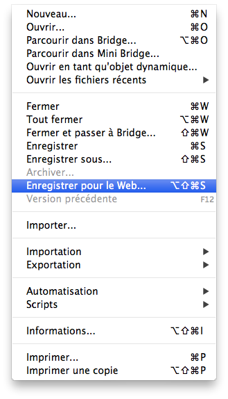
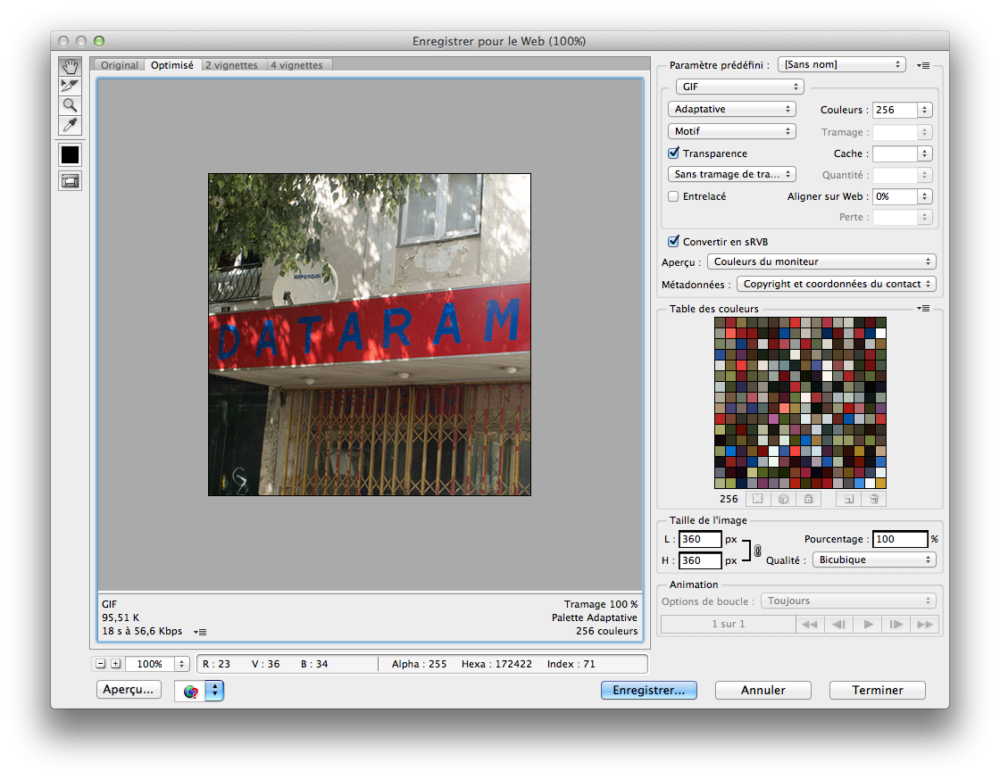
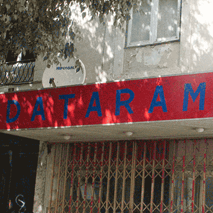
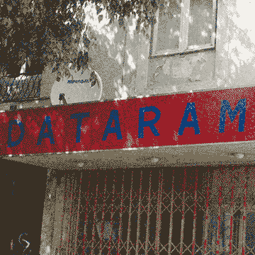
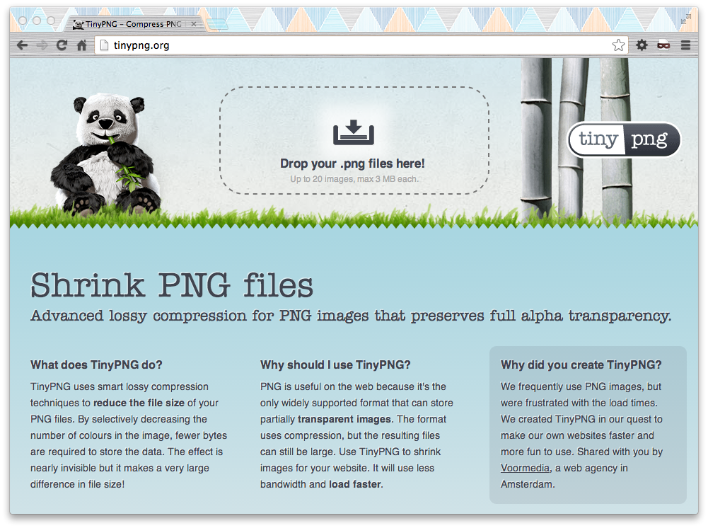

Travailler avec des images pour le web
========
au sein d’une page web, il existe plusieurs manières d’afficher des images. Quand on parle d’image pour le web, sont exclues les images vidéos (filmiques). En revanche, on inclue les GIF, qui peuvent être animées, et ce pour des raisons historiques (les GIF étant beaucoup plus leger que les vidéos à traiter par un ordinateur). 
	
## Enregistrer pour le Web
depuis Photoshop, afin `d’optimiser` les images et de réduire le temps de chargement de la page, on utilise l’outil **Enregistrer pour le Web**. cet outil nous aide à choisir tel ou tel type de compression et à voir les incidence sur la qualité de l’image. 
Il se situe dans le menu `Fichier > Enregistrer pour le Web` ou le raccourci **Cmd+Alt+Maj+S**

le même outil existe dans Illustrator. Illustrator permet en outre un export en `SVG`, puisque il est nativement **vectoriel**. 

## Les types d’images

plusieurs types d’images sont disponibles sur une page web, on en dénombre 

* 3 bitmaps
	* `GIF`
	* `JPEG`
	* `PNG`   
* 1 vectoriel 
	* `SVG`
	
### GIF

le gif est historiquement le premier format d’image apparu sur internet. c’est un format **très compressé**, et donc assez leger mais avec beaucoup de perte. 

Il utilise plusieurs principe de compression. Le principe de compression le plus simple à comprendre — c’est aussi celui qui a le plus d’incidence graphique — utilise le principe de `palette de couleur`. Le formatage consiste à définir une palette de couleurs réduites (256 maximum) utilisée dans l’image. On peut choisir le nombre de couleurs qui constituent l’image. plus il y aura de couleurs, plus le poids de l’image sera lourd, moins il y en a, plus la qualité est médiocre. 

le format gif est `adapté à des images de petite taille` (<500px). 

le gif permet d’utiliser de la `transparence mais sans niveau`. 

exemples avec 256, 32 et 8 couleurs (97ko, 48ko, 26ko) : 

   

Le gif permet aussi de faire des **animations** que l’on appelle gif-animé, ces animations sont fortement encodée, et ont beaucoup de perte. 

### JPEG

le jpeg est le format le plus populaire sur internet. Il a été massivement introduit avec l’arrivée de la photographie numérique, car il est très adapté à celle-ci. En effet il utilise la chrominance et la luminance comme base pour sa compression. Certains codages jpeg sont sans perte, mais souvent, ont utilise des codages avec perte (par quantification) le niveau de qualité permet de faire varier le poids et la qualité de l’image en fonction des besoins. 

le format jpeg est `adapté à des images de toute taille`. En raison de sa compression, on le privilégiera pour des images de très grande taille. 

sur des images non-photographique, où peuvent-être présent des graphiques en aplats, des typographies, et des visuels contrasté, la compression jpeg formera des artefacts d’encodage. Il est donc peu recommander d’utiliser le jpg pour des visuels non-photographiques. 

exemple de jpeg qualité 20/100 (18ko). 

### PNG-24

le format png 24 est un format d’image `sans perte`. pour cette raison, on l’utilise pour des images avec une haute exigence graphique, pour assurer l’intégrité des couleurs. Cette qualité rend les images assez **lourdes**.

le PNG 24 permet d’intégrer de la `transparence`, codé sur un `channel alpha` de `255` niveaux. C’est le seul format qui permet cela. 

l’exemple en PNG 24 fait 230ko. 

### PNG-8

le format png 8 est assez similaire au gif. 

### SVG

Sans trop s’attarder sur le format SVG — car moins utilisé, c’est le seul format vectoriel compatible. C’est un format qui hérite du XML, autrement dit, vous pouvez l’éditer avec un éditeur de texte. Cette caractéristique permet aussi de l'intégrer directement — *inline* (en ligne) — dans les balises HTML. 

illustrator permet l’export vectoriel SVG. 

le SVG n’utilise pas de compression et l’export illustrator n’est pas toujours très optimisé. il faut veiller à ne pas avoir des fichiers trop lourds. 

il a beaucoup d’avantage, car `scalaire` et convient bien aux graphiques en aplats et aux typographies. 

le SVG a un

## Optimisations

### Poids des images

sur internet, une des problématiques récurrente est celle du poids des fichiers. Les images sont des fichiers qui sont assez lourds, surtout quand ils sont nombreux. Il faudra veiller à optimiser ses images afin d’avoir une page assez rapide à charger, et concevoir des pages économes en ressources. Le temps de chargement est un facteur déterminant dans la poursuite — ou non — d’une navigation sur un site. 

taille du fichier |  correspond à |
:---------------- |
 < 10ko | très léger, icône. 
 de 10ko à 20ko | léger, miniature de galerie
 de 20ko à 40ko | moyen, grande miniature
 de 40ko à 100ko | moyen, visuel avec détail
 de 100ko à 200ko | grande image
 de 200ko à 500ko | grande image, complexe, transparence
 de 500ko à 1Mo | très grande image. (déconseillé)
 + de 1Mo | image mal compressée (déconseillé)
 
Globalement, plus une page comportera d’images (lourdes) plus elle sera longue à charger, ce qui n’est pas très *user-friendly*. 
le temps de téléchargement moyen d’un débit ADSL est de 80ko/s. donc pour charger 800ko, ça prend 10 secondes. c’est long. 

### Choix du type de fichier

une petite grille pour vous aider à choisir votre type de fichier

Format 	        | JPG | PNG-24 | PNG-8 | GIF | SVG | ko 
:-------------- | 
 compatibilité | - | IE7 | - | - | IE9 | -
 bitmap   | X | X | X | X |  | - 
 vectoriel   |   |  |  |  | X | -
 forte compression | X |  | X | X |  | -
 faible compression | X | X | | | | -
 sans perte |  | X |  |  |   | -
 grande image | X | X |  |  |  | 100 ko
 très grande image | X |  |  |  | | 300 ko
 photographie   | X |  |  |  |  | - 
 icône   |   | X | X | X |  | 10 ko
 typographie   |   | X | X | X | X | -
 flat design   |   | X | X | X | X | -
 transparence   |   | X | X | X | X | -
 sur 255 niveaux   |   | X |  | | | -
 palette réduite de couleurs | | X | X | X | | -
 contenus variés | X | X |  |  |  | 150 ko
 animation | |   |   | X | | - |
 

 
### TinyPNG : optimisation PNG-24
 
 le site [tinypng.org](http://tinypng.org/) est un `outil en ligne` qui permet de compressé des PNG-24 générés par photoshop, pour leur faire gagner jusqu’à 80% de leur taille, sans perdre la transparence sur 255 niveaux. Ils perdent cependant un petit peu de qualité. il utilise le principe de compression par palette de couleurs/transparences.
 
 