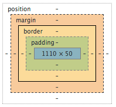
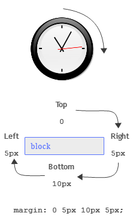

# LES PROPRIÉTÉS CSS BASICS

Voici une liste des propriétés à connaitre pour CSS, c’est l'essentiel. 

## les unités

Plusieurs unités de mesure se cotoient en CSS. Elles ont chacunes leurs rôles, et doivent être choisies en fonction. 
Elle peuvet être utilisées pour les tailles de block, les marges, les bordures, les positionnements. Mais aussi pour toutes les mesures typographiques, taille du corps, interlettrage, interlignage, etc…

#### px (pixels)
le pixel, noté `px` est la plus élémentaire de toutes et certainement la plus utilisée. la mesure en pixel associe un pixel de l'écran comme mesure étalon. 
#### em (proportionnelle au texte)
l’unité `em` est une unité qui se base sur la taille du corps de texte (font-size) ainsi, si ma balise a un corps de texte de 14px, 2em vaudra 28px. Ce principe s’hérite de balises parentes à enfantes :

```css
body{
	font-size :10px;
}
div{
	font-size : 2em;
}
```

```html
<body>
	niveau body
	<div>
		niveau 0
		<div>
			niveau 1
		</div>
	</div>
</body>
```
#### % (pourcentage)

l‘unité `%` représente la notion de pourcentage dans la mesure. Elle représente donc une **proportionnalité** d’une autre mesure. Si j'ai un `font-size: 150%;` cela équivaut à `font-size:1.5em;`. pour les blocs, si j'ai un bloc parent à `height:100px`, si sa balise enfant a `height:50%` alors cela équivaut à `height:50px`.

## le formatage du texte


<table>
	<tr>
		<th>propriété</th>
		<th>exemples de valeurs</th>
		<th>utilité</th>
	</tr>
	<tr>
		<td>font-size</td>
		<td>14px</td>
		<td>taille du corps</td>
	</tr>
	<tr>
		<td>font-weight</td>
		<td>bold, normal</td>
		<td>graisse</td>
	</tr>
	<tr>
		<td>font-family</td>
		<td>"Arial", sans-serif</td>
		<td>famille de caractère</td>
	</tr>
	<tr>
		<td>font-variant</td>
		<td>small-caps</td>
		<td>petites capitales</td>
	</tr>
	<tr>
		<td>font-style</td>
		<td>italic</td>
		<td>italique</td>
	</tr>
	<tr>
		<td>color</td>
		<td>#ff00ff</td>
		<td>couleur du texte</td>
	</tr>
	<tr>
		<td>line-height</td>
		<td>20px</td>
		<td>interlignage</td>
	</tr>
	<tr>
		<td>letter-spacing</td>
		<td>0.5px</td>
		<td>interlettrage</td>
	</tr>
	<tr>
		<td>word-spacing</td>
		<td>10px</td>
		<td>intermot</td>
	</tr>
	<tr>
		<td>text-align</td>
		<td>center, justify, right, left</td>
		<td>alignement</td>
	</tr>
	<tr>
		<td>text-align-last</td>
		<td>center, justify, right, left</td>
		<td>alignement de la dernière ligne</td>
	</tr>
	<tr>
		<td>text-indent</td>
		<td>20px</td>
		<td>indentation</td>
	</tr>
	<tr>
		<td>text-decoration</td>
		<td>underline, overline</td>
		<td>soulignement, surlignement</td>
	</tr>
	<tr>
		<td>text-shadow</td>
		<td>2px 2px #fff</td>
		<td>ombre de texte, dimensions et couleur</td>
	</tr>
	<tr>
		<td>text-transform</td>
		<td>uppercase, lowercase, capitalize</td>
		<td>transformation de casse</td>
	</tr>
</table>

## le formatage des blocs 


<table>
	<tr>
		<th>propriété</th>
		<th>exemples de valeurs</th>
		<th>utilité</th>
	</tr>
	<tr>
		<td>display</td>
		<td>none, block, inline, inline-block</td>
		<td>type de rendu</td>
	</tr>
	<tr>
		<td>position</td>
		<td>relative, absolute, fixed</td>
		<td>positionnement par rapport au reste de la page</td>
	</tr>
	<tr>
		<td>width</td>
		<td>100px, 100%, 10em</td>
		<td>largeur</td>
	</tr>
	<tr>
		<td>height</td>
		<td>100px, 100%, 10em</td>
		<td>hauteur</td>
	</tr>
	<tr>
		<td>padding*</td>
		<td>10px, 1%, 1em</td>
		<td>marge intérieure</td>
	</tr>
	<tr>
		<td>margin*</td>
		<td>10px, 1%, 1em</td>
		<td>marge extérieure</td>
	</tr>
	<tr>
		<td>border*</td>
		<td>solid 1px #000</td>
		<td>bordure</td>
	</tr>
	<tr>
		<td>background*</td>
		<td>#ff0000</td>
		<td>arrière-plan</td>
	</tr>
	<tr>
		<td>overflow</td>
		<td>hidden, scroll</td>
		<td>dépassement du contenu du bloc</td>
	</tr>
	<tr>
		<td>float</td>
		<td>left, right, none</td>
		<td>flottement</td>
	</tr>
	<tr>
		<td>clear</td>
		<td>both</td>
		<td>rupture de flottement</td>
	</tr>
	<tr>
		<td>top</td>
		<td>10px</td>
		<td>position à partir du haut</td>
	</tr>
	<tr>
		<td>right</td>
		<td>10px</td>
		<td>position à partir de la droite</td>
	</tr>
	<tr>
		<td>bottom</td>
		<td>10px</td>
		<td>position à partir du bas</td>
	</tr>
	<tr>
		<td>left</td>
		<td>10px</td>
		<td>position à partir de la gauche</td>
	</tr>
</table>




## *les raccourcis

Certains attributs CSS (voir ci-dessus) on des notations raccourcis. Ce qui signifie que l’on peut agglutiner des lignes de code en une seule. C’est le cas pour margin, padding, border et background. Elles ne sont pas les seules, mais ce sont les plus communes. 

#### les raccourcis pour margin et padding

```css
/* la notation raccourcie */
margin : 0 5px 10px 8px;

/* équivaut à */
margin-top: 0;
margin-right: 5px;
margin-bottom: 10px;
margin-left: 8px;
```
l’ordre Top Right Bottom Left peut se retenir sur le modèle de l’horloge. Une méthode mnémotechnique se base sur le mot TRouBLe où les consonnes sont les initiales des mots anglais. Trouvez celle qui vous ira le mieux !



#### les raccourcis pour border

pour le cas de border, c’est un peu plus complexe, car il y a plusieurs niveaux de raccourcis. il y a la position de la bordure (top right bottom left) et le style, la couleur de la bordure

```css
/* le raccourci */
border: solid 1px #000;

/* équivaut à */
border-style : solid;
border-width : 1px;
border-color : #000;

/* équivaut à */
border-top-style : solid;
border-top-width : 1px;
border-top-color : #000;
border-right-style : solid;
border-right-width : 1px;
border-right-color : #000;
border-bottom-style : solid;
border-bottom-width : 1px;
border-bottom-color : #000;
border-left-style : solid;
border-left-width : 1px;
border-left-color : #000;
```


## background image

Nous avons rapidement abordé la notion de background, par la couleur. 
ainsi, `background:#ffff00;` produit un arrière-plan au bloc, de couleur jaune. 
Les background gère également les images, est c’est un peu plus complexe, car cela ouvre plus de possibilités. 

<table>
	<tr>
		<th>propriété</th>
		<th>exemples de valeurs</th>
		<th>utilité</th>
	</tr>
	<tr>
		<td>background</td>
		<td>[notation raccourcie]</td>
		<td>notation raccourcie, pour la couleur, l'image, etc…</td>
	</tr>
	<tr>
		<td>background-color</td>
		<td>#00ff00</td>
		<td>couleur d’arrière-plan</td>
	</tr>
	<tr>
		<td>background-image</td>
		<td>url("mon-image.jpg")</td>
		<td>adresse de l'image — toujours avec url('')</td>
	</tr>
	<tr>
		<td>background-repeat</td>
		<td>repeat, no-repeat, repeat-x, repeat-y</td>
		<td>répétition de l'image d’arrière plan</td>
	</tr>
	<tr>
		<td>background-position</td>
		<td>[coordonnées x y]</td>
		<td>position en x et en y (en pixel, em, % ou top/left/right/bottom)</td>
	</tr>
	<tr>
		<td>background-size</td>
		<td>cover, 100%, 100px</td>
		<td>taille de l'image d'arrière-plan</td>
	</tr>
	<tr>
		<td>background-clip</td>
		<td>padding, border</td>
		<td>point d’accroche de l'arrière-plan</td>
	</tr>
	<tr>
		<td>background-clip</td>
		<td>cover, 100%, 100px</td>
		<td>taille de l'image d'arrière-plan</td>
	</tr>
</table>

