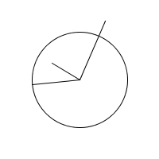

Horloge 1
===============

## notions abordées

- dessin basique *processing static mode*
- dessin animé
- principe de paramètres
- transformations de dessin

## mots-clés Processing

- *;* (fin d'une instruction)
- *ellipse*
- *line*
- *size*
- *background*
- *width* & *height*
- *float* (variables)
- *=* (association)
- *translate*
- *rotate*
- *pushMatrix* & *popMatrix*
- *//* (commentaires en ligne)

