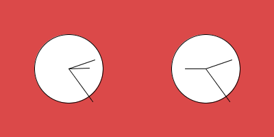
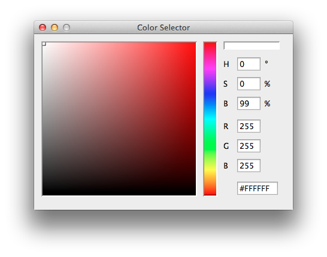

Horloge 2
===============


## notions abordées

- réutilisation de fragment code avec la création de **fonctions** (function) personnalisées.<br/>
la syntaxe élémentaire d’une fonction est la suivante :
	
```
void maFonction(){

	/* début de la fonction */
	
	
	/* fin de la fonction */
	
}
```
- on `appelle` la fonction ensuite de cette manière :
	
```
	maFonction();
```

- utilisation d’une variable globale (dans notre cas un time offset)
- couleur en RGB dans background, avec utilisation de la pipette. on obtient la pipette de couleur depuis le menu `Tools > Color Selector`
 
les valeurs à utiliser sont celles écrites dans R G et B (Rouge Vert et Bleu) séparées par des virgule. 

	le blanc est donc 255,255,255, le <span style="color:red;">rouge 255,0,0</span>, le <span style="color:green;">vert 0,255,0</span> et le <span style="color:blue;">bleu 0,0,255</span>


## mots-clés Processing

- *function* (principe de fonction)
- */\* \*/* (commentaires en bloc)
- *background(r,g,b)* (couleur d’arrière-plan)

