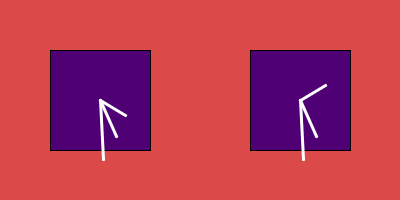

Horloge 3
===============

## notions abordées

- sauvegarder l’image en screenshot, via la fonction *saveFrame()*
- le type *color* pour sauvegarder une couleur. 
- remplissage de couleur (fill)
- couleur et épaisseur du trait (stroke)
- tracer un rectangle
- mode de rectangle et d’éllipse		

## mots-clés Processing

- *saveFrame( )*
- *color*
- *fill( color )* 
- *noFill( )*
- *stroke( color )*
- *noStroke( )*
- *strokeWeight( size )*
- *rect( x,y, width,height )*
- *rectMode( type )* & *ellipseMode( type )* 
  - CORNER
  - CORNERS
  - CENTER
  - RADIUS
- *import* library
- *Date* & *Date.getTime( )*

