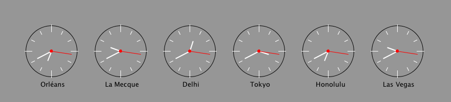
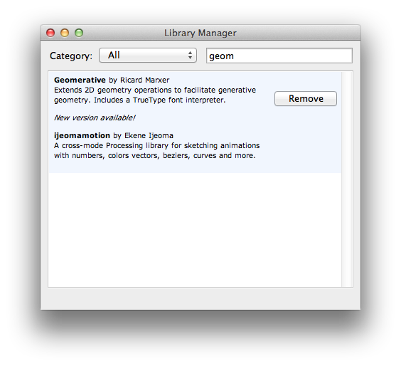

Horloge 4
===============


nous avons vu dans les précédents cours que l’aiguille des secondes — pour afficher la trotteuse en *course permanente* —n'était pas réglée sur le *temps réel* de l’ordinateur car il utilisait la fonction **millis()** qui affiche les millisecondes depuis le début du lancement du programme. 
Nous allons devoir utiliser la librairie Java *Date* pour avoir cette information là. 

## notions abordées

- rechercher dans la **référence**, la `documentation`. le raccourci clavier est `CMD`+`MAJ`+`F` sur un mot clé Processing, ou menu `Help > Reference`. La référence est le dictionnaire illustré du langage processing, sa documentation. Tous les mots-clés du langages sont là. 
- importer une librairie externe, en début du programme :

	```
import java.util.Date; // importe la librairie Java 
						// nommée java.util.Date
						// pour le traitement des Dates. 
	```
	les librairies (*library*) servent à étendre les fonctionnalités de base de processing. ici Date nous permet d’avoir des informations plus précises sur la date, comme .getTime(); <br/>On peut aussi ajouter une librairie externe, en l’ajoutant depuis le menu `Sketch > import library… > add Library…` on arrive sur cette boite de dialogue : <br/>  
	on peut alors gérer (ajouter/supprimer les librairies). les librairie installées de cette manière seront présentes dans le dossier /~User Documents~/Processing/librairies/ <br/>
``` Attention : quand une librairie est utilisée dans une sketch, si  vous testez votre sketch sur un autre ordinateur et que la librairie n’est pas installée, vous aurez des erreurs. ```

- les bases de la **[Programmation Orientiée Objet (POO)](http://fr.wikipedia.org/wiki/Programmation_orient%C3%A9e_objet)** 
- **la syntaxe à point**. exemple, l’objet Date();
- les boucles `for` dites **itératives**. Les boucles `for` servent à répéter une opération un nombre de fois. La boucle utilise une variable *compteur* et l’incrémente (ajoute une unité à celle-ci). on la note, dans sa forme la plus courante, ainsi : 

	```
	for(int i = 0; i<12; i++){
		// ici, c’est i qui est la variable
		// on va donc répété l’opération (présente entre accolades)
		// 12 fois. 
	}
		
	```
	
	la variable `i` est souvent utilisé dans les boucles `for` car elle signifie `iterative`. on peut utiliser le nom que l'on veut pour cette variable. on peut aussi faire des étapes (step) entre chaques itérations ou partir d'une valeur inférieure à 0, exemple : 

	```
	for(int maVariable = -6; maVariable<12; maVariable +=3){
		// ici on utilise maVariable, 
		// on fait une boucle de -6 à 12, avec un pas de 3
		// on va donc faire 5 fois la boucle :
		// -6, -3, 0, 3, 6, 9
		// si on voulait faire aussi le 12
		// il faudra écrire maVariable <=12 (supérieur ou égal)
	}
	```
- l’opérateur [modulo](http://fr.wikipedia.org/wiki/Modulo_(op%C3%A9ration\)) noté `%`. le modulo est une opération mathématique qui, pour simplifier, renvoie le reste d’une division (euclidienne). 
	
	```
	7 % 2 = 1 // car 7 = 2 * 3 + 1
	8 % 2 = 0 // car 8 = 2 * 4 + 1
	8 % 3 = 2 // car 8 = 3 * 2 + 2
	9 % 3 = 0 // car 9 = 3 * 3 + 0
	9 % 7 = 2 // car 9 = 7 * 1 + 2
	0 % 2 = 0 // car 0 = 2 * 0 + 0
	1 % 10 = 1 // car 1 = 10 * 0 + 1
	35 % 10 = 5 // car 35 = 10 * 3 + 5
	35 % 2 = 1 // car 35 = 17 * 2 + 1
	35.24 % 2 = 1.24 // car 35 = 17 * 2 + 1.24
	
	```
	
	on se sert souvent du modulo dans les boucles for, pour exclure une partie des opérations, typiquement *une sur deux* — la logique paire/impaire, avec le `modulo 2`.	exemple :
	
	```
	for(int i=0; i<12; i++){
		int impaire = i%2;
		rect(i*7,0,4,10+impaire*10);
		// dessine un grand et un petit rectangle, suivant paire et impaire. 
	}
	```

 		

## mots-clés Processing

- *import* library
- *Date* & *Date.getTime( )*
- *%* Modulo
- *for(){}* boucle for


