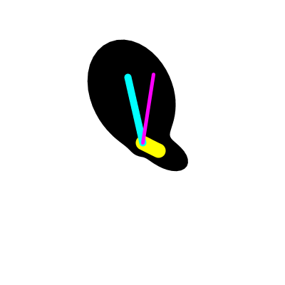

# Idée zéro
une **horloge patatoïdale**, les aiguilles montre l’heure temps réel, alors que le cadran devient mou (je pense à Dali) la patate se recompose en temps réel et suit les aiguilles. j'ai aussi ajouté les millisecondes, pour rendre plus liquide la patate. 

utilise :

- les fonctions mathématiques
	- `cos`[inus]
	- `sin`[us]
	- `pow` (puissance)
	- `max` (seuil maximum) 
- le `vertex` et `beginShape` `endShape` (forme polygonale) pour faire ma patate pleine
- la date Java pour avoir de la précision dans mes millisecondes