# IDÉE UNE / Horloge de photographies numérales

l’idée est de faire une horloge numérique sous processing, à partir d'une série de photographies (prise avec mon iPhone) de Nombres visibles dans l’espace publique, et donc ça passe aussi par un safari photo (en cours). 
Cet essai va nous permettre de voir comment travailler avec des `fichiers externes` à processing, ici des images. 
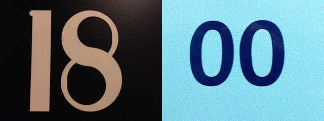

## le dossier « *data* »

Dans processing, pour travailler avec des ressources externes, sous forme de fichier, on doit les placer dans un dossier `data` à côté du fichier `.pde` du sketch processing. Les ressources que nous pouvons traiter avec Processing seront très variés, cela va des images, aux tableaux excel CSV, en passant par du texte au format .txt et il faudra choisir ces types de fichier en fonction de nos applications. 

il existe une astuce pour accéder directement au dossier du sketch c’est la commande `CMD+K` (ou menu `sketch > show sketch folder`). Évidement, Vous avez au préalable enregistré votre fichier sur votre ordinateur (ça doit être un réflex quand on commence un sketch)

par exemple dans notre cas, voici ce que j’ai :

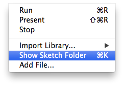
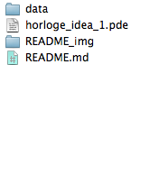

si le dossier `data` n'est pas créé, il faut le faire manuellement depuis l'explorateur de fichier (explorer/Finder) `Créer un nouveau dossier`. **Attention** il faut veiller à respecter la **casse** et ne pas écrire <del>`Data`</del> ou <del>`DATA`</del> pour ce dossier. On pourra ensuite faire des sous-dossiers dans ce dossier, pour organiser nos contenus. 
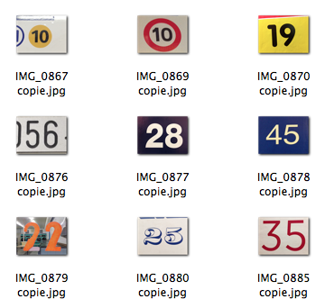

## traitement des images par lot dans Photoshop

J’ai fait mon safari photo, j'ai mes images (pas encore toutes !!) mais celles-ci sortent directement de mon iPhone et ne sont pas adaptées à un usage direct dans Processing. En effet, elle sont très lourdes (ici souvent supérieure à 2Mo) et très grande (3264x2448 pixels). Je dois toujours veiller à cela avant de les utiliser. J’utilise mon explorateur de fichier `CMD+I` pour afficher ces informations du fichier et les verifier, ici ça me donne ça :

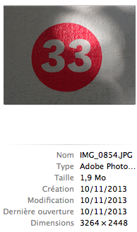

Je veux donc les réduire afin qu’elle est une taille et un poids raisonable pour mon application. J’ai arbitrairement choisi pour notre cas une dimension de 320x240 pour ces fichiers, dimension qui conserve le ration 4/3 de la photo. 

	« OUI ! sauf que j’ai 60 photos »
	
là est bien notre problème. Heureusement, les ordinateurs et les logiciels savent faire des tâches répétitives ! Ici, pour traiter les images, nous allons utiliser les `scripts` et le `traitement par lot` de Photoshop. D’autres solutions peuvent être envisagé, nottement directement dans Processing. Mais ici, c’est plus simple, et ça vous apprend que Processing peut se coupler à d’autres logiciels, qui chacun ont leurs spécialités. 

#### Créer un « script » Photoshop

Le principe de `script` dans Photoshop est assez simple. On enregistre nos faits et gestes dans un temps, on les rejoue dans un autre. Il faut ouvrir la fenêtre `scripts`. On voit que pas mal de script sont pré-installé avec Photoshop. 

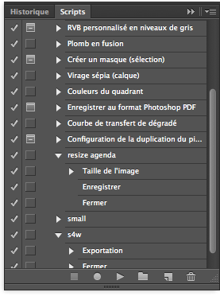

On va créer un `nouveau script` à partir du bouton, et on renseigne son nom dans la boite de dialogue 

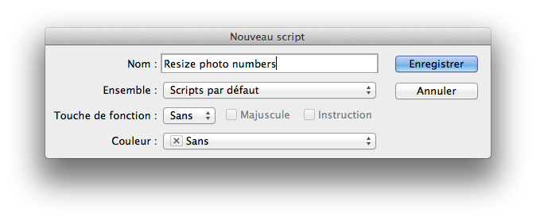

après l’avoir enregistré, on observe que le bouton `Enregistrement` est passé en rouge . Cela signifie que l'enregistrement et actif, et que chaque action dans photoshop est enregistrée. On peut à tout moment arrêter ou reprendre cet enregistrement. On peut aussi `executer` ce script (une fois qu'il est enregistré) en appuyant manuellement sur le bouton `lecture`. Nous procederont autre, par **`lot`**.

#### Enregistrer un script

Il existe beaucoup de manière de faire ces scripts, à vous de trouver la votre. Dans notre cas, notre script devra redimensionner l’image et l'enregistrer. 

J'ouvre donc un fichier image témoin avant de débuter l'enregistrement du script. Une fois ouvert, je commence l’enregistrement en appuyant sur le bouton enregistrer de la fenetre script qui doit passer en rouge . 

Dans mon cas je fais les deux actions qui m'intéressent `Taille de l’image` et `enregistrer sous (en tant que copie)`: 
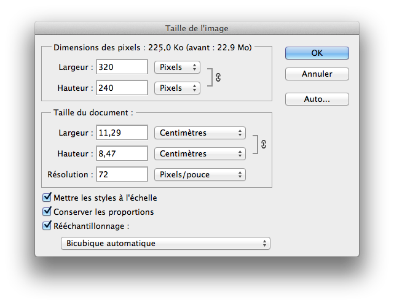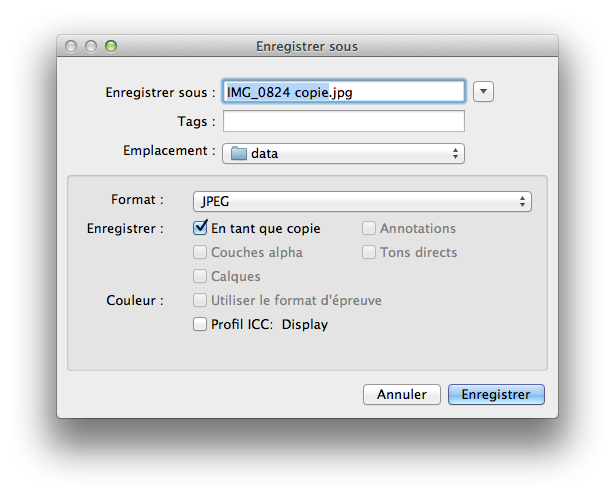

on voit que les deux actions ont été enregistrées dans notre script. je peux alors arreter l’enregistrement en cliquant sur le bouton `stop` le rond rouge d’enregistrement repasse logiquement en gris, le script est fait. Les actions sont bien visibles dans la fenêtre scripts.

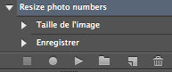

#### Traitement par lot

On arrive au moment décisif du travail, et parfois laborieux et complexe. Je vous conseille toujours de faire des copies de vos `Lots` avant de les traiter, pour éviter tout écrasement de fichier. <span style="color:red;">Une erreur est vite arrivée !</span> Donc, pour effectuer un traitement par lot, il faut faire menu `Fichier > Taitement par Lots…`. La boite de dialogue apparait :


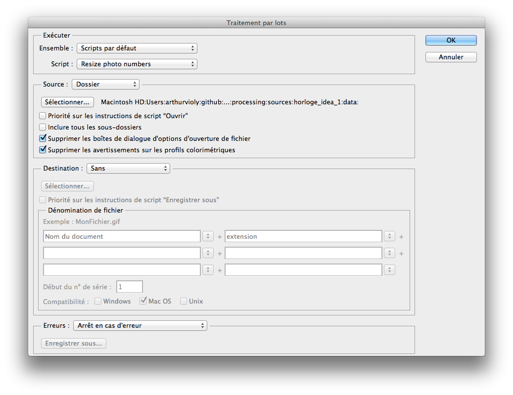

Je ne m'attarderai pas sur les diverses fonctions de ce traitement par lot, car il y a beaucoup d’options. Dans notre cas, vu que j'ai intégré `Enregister sous (en tant que copie)` dans mon script, je n'ai pas besoin de *destination*, une copie du fichier sera faite à côté de lui. 
Je dois quand même **Sélectionner** mon dossier *source* qui contient mon lot d’images. Je vous laisserai tester toutes les variantes et les possibilités qu'offre le traitement par lot. 

#### résultat du traitement par lot
Dans notre cas, le traitement par lot a bien créé des copies **« basse définition »**  de mes images sources. Ses images sont au bon format, et légeres, prêtes à l’emploi. 

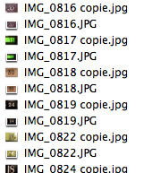

je vais déplacer toutes ces copies dans un dossier à part, et **vérifier** que celui-ci est bien dans le dossier `data` de mon sketch Processing que je travaille, comme vu plus haut. 

## charger et afficher un fichier image dans Processing

Processing permet d’afficher des images **bitmap**. Il gere de nombreux formats (JPEG, PNG, GIF, TGA …). Dans Processing l’objet qui traite les images, et le type `PImage` 

L’affichage d'une image se fait en deux temps, 1. le chargement (dans la mémoire RAM) 2. l’affichage. Évidement on ne peut pas afficher une image non chargée.

la syntaxe minimum pour afficher une image est la suivante : 
	 
```processing	
// affiche une fenetre de 320x240 pixels
size(320,240); 
// charge une image dans la RAM 
// à partir de son chemin dans le dossier data
// et l'associe à l’objet monImage, de type PImage
PImage monImage = loadImage("export/IMG_0831 copie.jpg"); 
// affiche l’image précedement chargée aux coordonées 0,0 
image(monImage,0,0);

```

pour commencer, pour l'instant nous allons afficher 2 images, pour afficher l'heure 18 et 00 

```processing
//
size(640,240); // fenetre de 640x240 (pour 2 images en largeur)
//
// nous n'avons pas encore renommé les images JPEG
String monChemin00 = "export/IMG_0831 copie.jpg"; // chemin du fichier image 00
String monChemin18 = "export/IMG_0824 copie.jpg"; // ceemin du fichier image 18
//
// je charge ma premiere image 18
PImage monImage18 = loadImage(monChemin18);
//
// j'affiche mon image 18
image(monImage18,0,0);
//
// je charge ma seconde image 00
PImage monImage00 = loadImage(monChemin00);
//
// je me déplace à droite de 320 pixels
// et j'affiche ma seconde image 00
translate(320,0);
image(monImage00,0,0);
//
// je vais une sauvegarde de l'image
saveFrame("screenshot.png");
//
```

